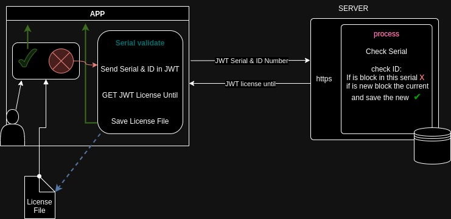

# Licensevalidator

`licensevalidator` is a Go package that provides functions for validating software licenses.using one of two methods: license file or serial number with regular verification via the Internet.

## Authors

- [@Franklin Diaz](mailto:fdiaz@adaptiveomputing.com)

## Acknowledgements

- [JWT.io](https://jwt.io) For providing an invaluable tool for decoding, verifying, and generating JSON Web Tokens, which was crucial for our project's authentication and authorization processes.

- [Public-key cryptography (Wikipedia)](https://en.wikipedia.org/wiki/Public-key_cryptography) For the comprehensive information on public-key cryptography, which enhanced our understanding and implementation of secure communication protocols in our project.

## Explanation of Operation

